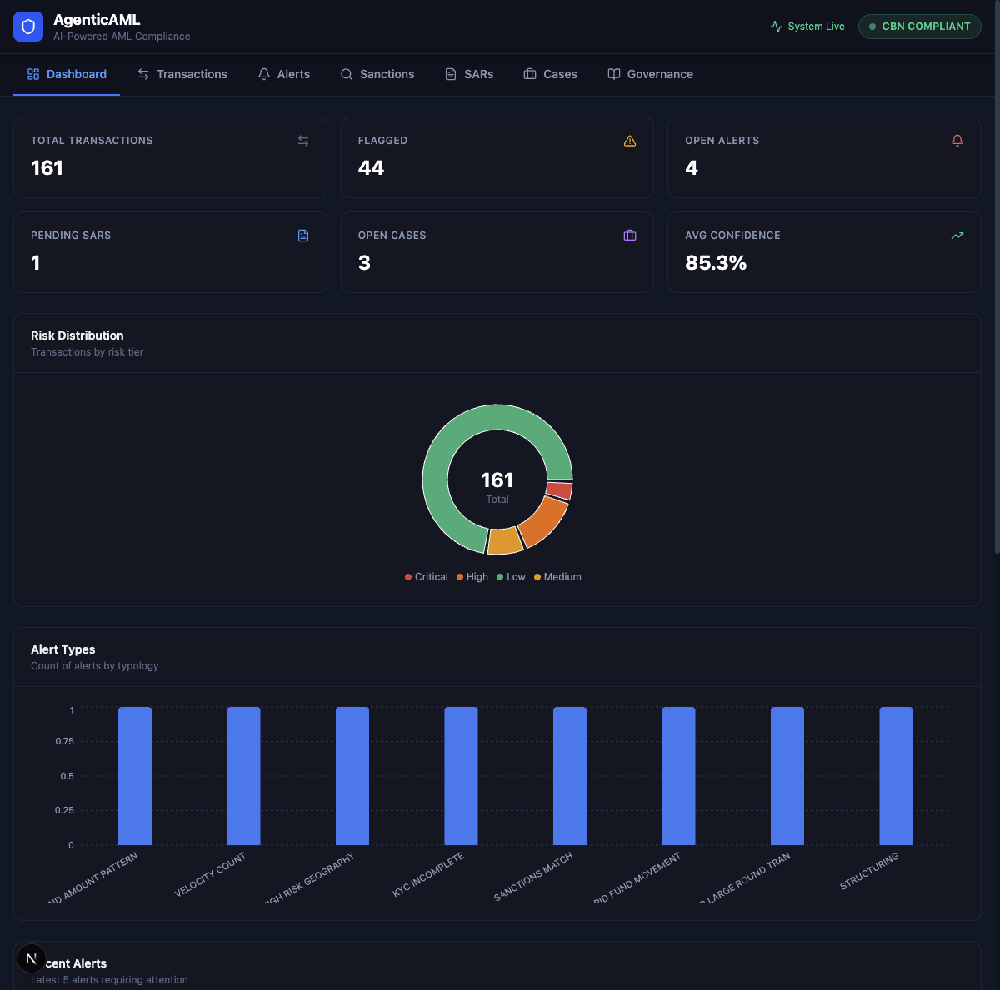
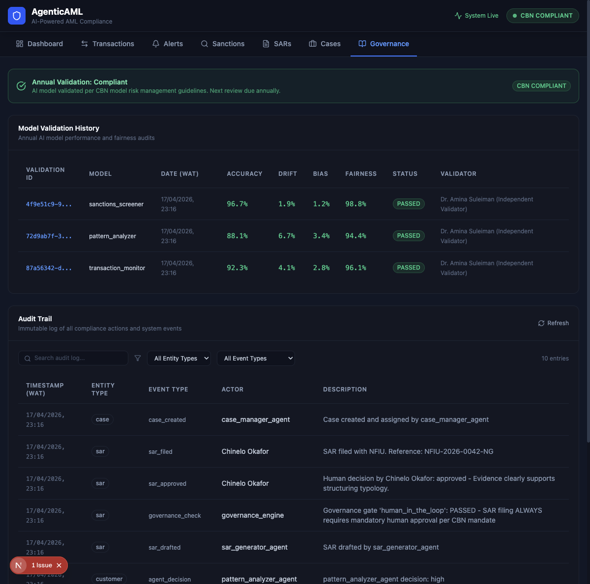
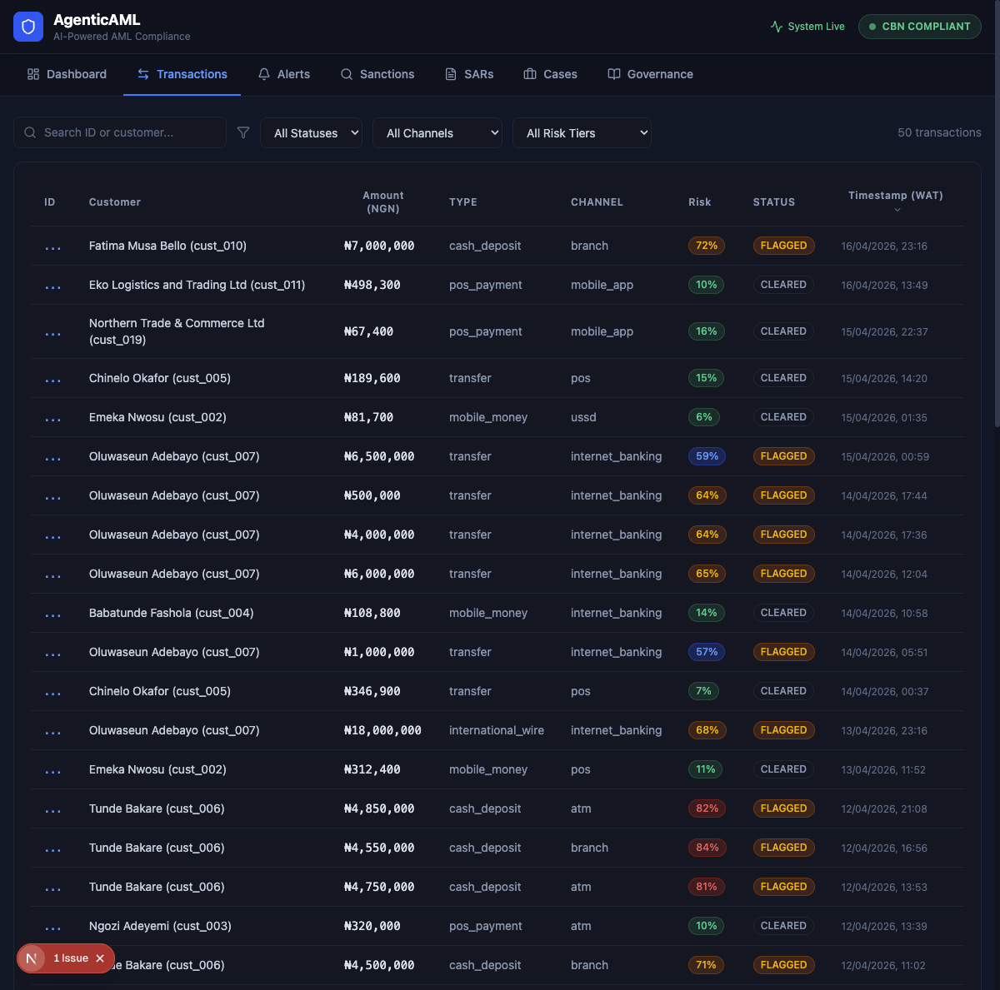
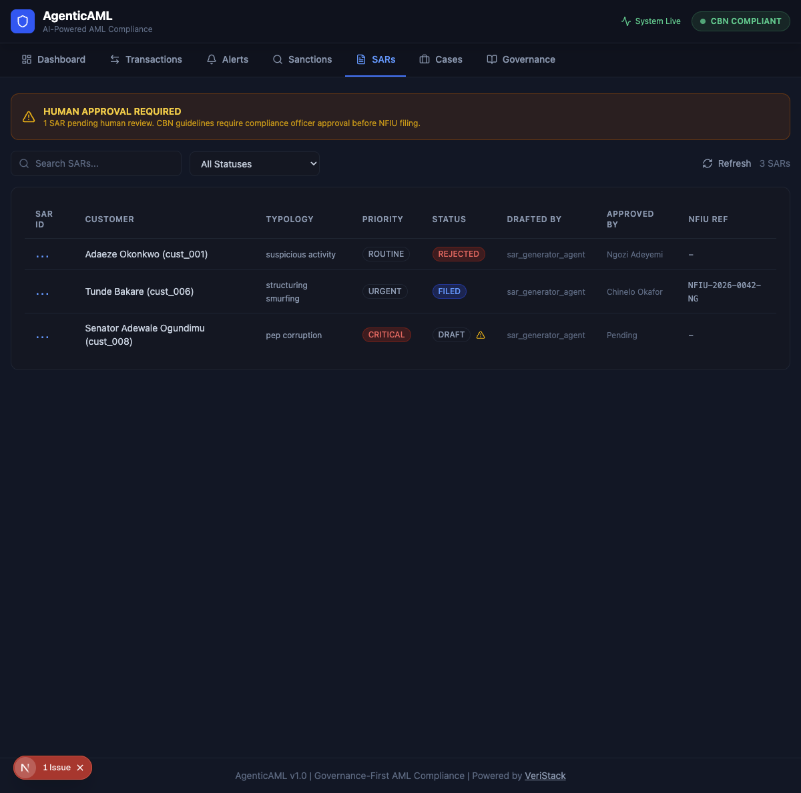

# AgenticAML

**AI-Powered Anti-Money Laundering Compliance for Nigerian Financial Institutions**

AgenticAML is a governance-first, multi-agent AML system built to meet the [CBN Baseline Standards for Automated AML Solutions](https://www.cbn.gov.ng/Out/2026/CCD/CBN%20issues%20Baseline%20Standards%20for%20Automated%20Anti-Money%20Laundering%20Solution.pdf) (Circular BSD/DIR/PUB/LAB/019/002, March 10, 2026). Six AI agents work together to monitor transactions, verify identities, screen sanctions, detect patterns, draft SARs, and manage cases, with a governance engine enforcing compliance controls at every stage.



## Why This Exists

On March 10, 2026, the Central Bank of Nigeria issued a directive requiring ALL regulated financial institutions to deploy automated AML systems. Banks have 18 months. Fintechs have 24 months. Every institution must submit an implementation roadmap by June 10, 2026.

Most existing AML solutions (Oracle FCCM, NICE Actimize, SAS AML) cost $500K to $2M+ to implement. AgenticAML provides the same capabilities at a fraction of the cost, purpose-built for the Nigerian regulatory context with governance embedded from the ground up.

## The Agent Pipeline

```
Transaction Data
       |
       v
 [1. Transaction Monitor]     Rule-based threshold screening
       |                       Cash NGN 5M+, transfers NGN 10M+,
       |                       velocity, structuring, dormant accounts
       v
 [2. KYC Verifier]            Identity verification
       |                       BVN/NIN validation, risk tier assignment,
       |                       PEP status, completeness checks
       v
 [3. Sanctions Screener]      Multi-list screening
       |                       OFAC, UN, Nigerian domestic, PEP,
       |                       internal watchlist, adverse media
       v
 [4. Pattern Analyzer]        Behavioral analysis (Rule-based + LLM)
       |                       Structuring, layering, circular flows,
       |                       geographic anomalies, PEP corruption
       v
 [5. SAR Generator]           Suspicious Activity Report drafting
       |                       NFIU-format STRs, evidence packaging,
       |                       priority assignment
       v
 [6. Case Manager]            Investigation management
       |                       Auto-assignment, SLA tracking,
       |                       escalation chains, regulatory reports
       |
  Governance Engine
  (inline at EVERY stage)
```

## Governance Engine: The Differentiator

The governance engine is not a reporting layer. It runs **between every agent stage** and enforces six control gates:

| Gate | What It Does | CBN Requirement |
|------|-------------|-----------------|
| **Confidence Gate** | Routes uncertain AI outputs (below 0.7) to human review | AI model governance |
| **Materiality Gate** | Requires additional review for transactions above NGN 50M | Enhanced due diligence |
| **Sanctions Block** | Auto-blocks confirmed sanctions matches immediately | Mandatory asset freezing |
| **Human-in-the-Loop** | SAR filing always requires human approval. Always. | MLRO oversight |
| **Escalation Chain** | Routes critical/high risk to appropriate compliance tier | Risk-based escalation |
| **KYC Escalation** | Escalates failed identity verification to compliance officer | KYC compliance |

Every gate evaluation (pass or fail) is logged to an **immutable audit trail**. A passed gate is as important as a failed one, because it proves the control was evaluated.

## AI Model Governance (CBN Section 9)

The CBN directive mandates annual independent validation of all AI/ML models with accuracy, drift, bias, and fairness testing. AgenticAML tracks all four:

| Dimension | How Measured |
|-----------|-------------|
| **Accuracy** | Agent predictions vs. confirmed investigation outcomes |
| **Model Drift** | Current performance vs. deployment baseline (15% threshold triggers fallback to rule-based) |
| **Bias** | Alert distribution across customer demographics, geography, naming conventions |
| **Fairness** | Equal false positive/negative rates across customer segments |

**Key design principle:** The primary decision pipeline is rule-based and deterministic. The LLM (GPT-4o) augments analysis with narrative reasoning but never overrides rules. If the LLM goes down, the system keeps running with zero loss of core AML capability.



## Screenshots

### Dashboard
Real-time compliance overview with risk distribution, alert types, and regulatory alignment indicators.


### Transactions
161 monitored transactions with color-coded risk scores, filterable by status, channel, and risk tier.



### SARs (Human Review)
Mandatory human-in-the-loop for SAR filing. Agents draft, humans approve. Every decision logged with rationale.



### Governance
Full audit trail, model validation history with accuracy/drift/bias/fairness scores, and governance control status.


## CBN Compliance Coverage

AgenticAML covers **90% (41 of 46)** CBN directive requirements. Full compliance matrix: [docs/cbn_compliance_matrix.md](docs/cbn_compliance_matrix.md)

| CBN Section | Coverage |
|-------------|----------|
| Customer Identification (KYC) | 60% (biometrics are hardware-dependent) |
| Know Your Business (KYB) | 38% (document management is a production feature) |
| Risk Assessment & Profiling | **100%** |
| Sanctions & PEP Screening | **100%** |
| Transaction Monitoring | **100%** |
| Investigation & Case Management | **100%** |
| Regulatory Reporting | **100%** |
| Audit & Governance | **100%** |
| AI/ML Requirements | **100%** |

## Tech Stack

| Component | Technology |
|-----------|-----------|
| Backend | Python 3.12, FastAPI |
| Database | SQLite (demo), PostgreSQL (production) |
| Agent Framework | LangChain |
| LLM | OpenAI GPT-4o (configurable, optional) |
| Frontend | Next.js 16, TypeScript, Tailwind CSS, Recharts |
| Containerization | Docker, Docker Compose |
| CI/CD | GitHub Actions |
| Testing | pytest |

## Quick Start

### Prerequisites
- Python 3.12+
- Node.js 18+
- OpenAI API key (optional, for LLM-augmented analysis)

### Backend

```bash
git clone https://github.com/Dewale-A/AgenticAML.git
cd AgenticAML

# Create virtual environment
python -m venv .venv
source .venv/bin/activate

# Install dependencies
pip install -r requirements.txt

# Configure (optional)
cp .env.example .env
# Edit .env to add OPENAI_API_KEY for LLM features

# Run (database auto-seeds on first start)
DB_PATH=./data/aml.db uvicorn src.main:app --port 8003
```

The API is now live at `http://localhost:8003`. Visit `http://localhost:8003/docs` for the interactive API documentation.

### Frontend

```bash
cd frontend
npm install
npm run dev
```

Dashboard is now live at `http://localhost:3000`.

### Docker

```bash
docker-compose up -d
```

## API Endpoints (35 total)

<details>
<summary>Click to expand full API reference</summary>

### Core Pipeline
| Method | Endpoint | Description |
|--------|----------|-------------|
| POST | `/transactions/screen` | Screen a transaction through the full 6-agent pipeline |
| POST | `/transactions/batch` | Batch screen multiple transactions |

### Transactions
| Method | Endpoint | Description |
|--------|----------|-------------|
| GET | `/transactions` | List transactions (filterable) |
| GET | `/transactions/{id}` | Transaction details with linked alerts |

### Customers
| Method | Endpoint | Description |
|--------|----------|-------------|
| GET | `/customers` | List all customers |
| GET | `/customers/{id}` | Customer profile with risk history |
| POST | `/customers/{id}/kyc` | Trigger KYC verification |
| PUT | `/customers/{id}/risk-tier` | Update risk tier (requires approval) |

### Alerts
| Method | Endpoint | Description |
|--------|----------|-------------|
| GET | `/alerts` | Alert queue (filterable by status, severity, agent) |
| GET | `/alerts/{id}` | Alert details |
| PUT | `/alerts/{id}/assign` | Assign alert to analyst |
| PUT | `/alerts/{id}/resolve` | Resolve alert (requires rationale) |

### Sanctions
| Method | Endpoint | Description |
|--------|----------|-------------|
| GET | `/sanctions/screen` | Screen a name against all lists |
| GET | `/sanctions/matches` | List all matches |
| POST | `/sanctions/matches/{id}/review` | Review a match (approve/dismiss) |

### SARs
| Method | Endpoint | Description |
|--------|----------|-------------|
| GET | `/sars` | List all SARs |
| GET | `/sars/{id}` | SAR details |
| POST | `/sars/{id}/approve` | Approve SAR for filing (human decision) |
| POST | `/sars/{id}/reject` | Reject SAR draft (with rationale) |
| POST | `/sars/{id}/file` | File approved SAR with NFIU |

### Cases
| Method | Endpoint | Description |
|--------|----------|-------------|
| GET | `/cases` | List cases |
| GET | `/cases/{id}` | Case details with full history |
| PUT | `/cases/{id}/status` | Update case status |
| PUT | `/cases/{id}/assign` | Assign case |

### Governance
| Method | Endpoint | Description |
|--------|----------|-------------|
| GET | `/governance/dashboard` | Governance dashboard (stats, controls, metrics) |
| GET | `/governance/audit-trail` | Full audit trail (filterable) |
| GET | `/governance/audit-trail/{entity}` | Audit trail for specific entity |
| GET | `/governance/model-validation` | Model validation history |
| POST | `/governance/model-validation` | Record a model validation |

### Reporting
| Method | Endpoint | Description |
|--------|----------|-------------|
| GET | `/reports/daily` | Daily compliance summary |
| GET | `/reports/weekly` | Weekly compliance report |
| GET | `/reports/str-summary` | STR filing summary |
| GET | `/reports/alert-analytics` | Alert analytics |

</details>

## Seed Data

The system auto-seeds with realistic demo data on first run:

- **20 customers**: Mix of individuals and businesses, various risk tiers, some PEPs, some with incomplete KYC. Nigerian names and context.
- **161 transactions**: Transfers, cash deposits/withdrawals, international wires, mobile money. Amounts from NGN 10K to NGN 100M. Includes suspicious patterns: structuring, rapid movement, geographic anomalies, dormant account activity.
- **8 alerts**: Generated by the agent pipeline, various severities and types.
- **3 SARs**: One pending approval (human review required), one approved and filed with NFIU, one rejected with rationale.
- **5 cases**: Active investigations at different stages.
- **Audit trail**: Full governance decision chain showing agent decisions, gate evaluations, and human actions.
- **Model validations**: Three AI models validated with accuracy, drift, bias, and fairness scores.

## Architecture


## Regulatory References

- [CBN Baseline Standards for Automated AML Solutions](https://www.cbn.gov.ng/Out/2026/CCD/CBN%20issues%20Baseline%20Standards%20for%20Automated%20Anti-Money%20Laundering%20Solution.pdf) (March 2026)
- Money Laundering (Prevention and Prohibition) Act 2022
- FATF Recommendations (40 Recommendations)
- CBN AML/CFT/CPF Guidelines
- NFIU STR Filing Requirements

## Project Structure

```
AgenticAML/
  src/
    main.py                   FastAPI app, routes, startup
    database.py               Database setup, all CRUD operations
    models.py                 Pydantic models
    agents/
      transaction_monitor.py  Agent 1: Rule-based threshold screening
      kyc_verifier.py         Agent 2: Identity verification
      sanctions_screener.py   Agent 3: Multi-list sanctions screening
      pattern_analyzer.py     Agent 4: Behavioral pattern detection
      sar_generator.py        Agent 5: SAR/STR drafting
      case_manager.py         Agent 6: Case management
    governance/
      engine.py               Governance evaluation engine (6 gates)
      rules.py                Configurable regulatory thresholds
      audit.py                Immutable audit trail logging
    data/
      seed.py                 Demo data generation
      sanctions_lists.py      Simulated sanctions databases
      sample_transactions.py  Transaction generator
  frontend/
    src/
      app/                    Next.js App Router
      components/             Dashboard, Transactions, Alerts, etc.
  tests/                      pytest test suite
  docs/
    architecture.svg          System architecture diagram
    cbn_compliance_matrix.md  CBN requirement mapping (90% coverage)
```

## Production Considerations

For production deployment at a financial institution:

1. **Database**: Migrate from SQLite to PostgreSQL with connection pooling
2. **Authentication**: Add RBAC (analyst, senior analyst, compliance officer, MLRO roles)
3. **Biometrics**: Integrate with BVN/NIN APIs and liveness detection SDKs
4. **Encryption**: TLS for all API communication, encryption at rest for PII
5. **Monitoring**: Structured logging, Prometheus metrics, Grafana dashboards
6. **High Availability**: Multi-instance deployment behind a load balancer
7. **Data Retention**: 5-year minimum for audit trail records (NFIU requirement)

## License

MIT

---

**Built by [VeriStack](https://veristack.ca)** | Governance-First AML Compliance
