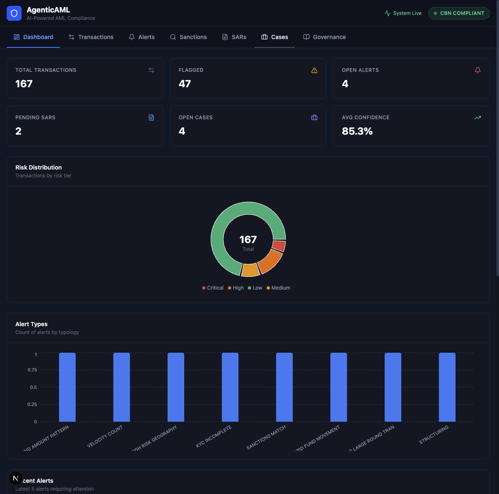
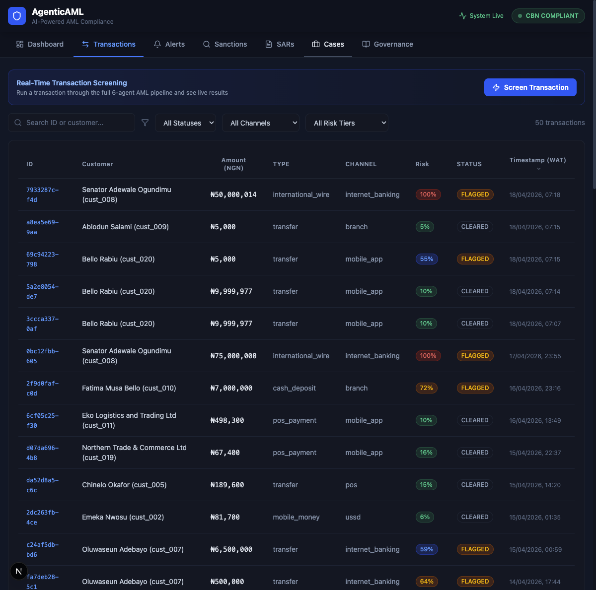
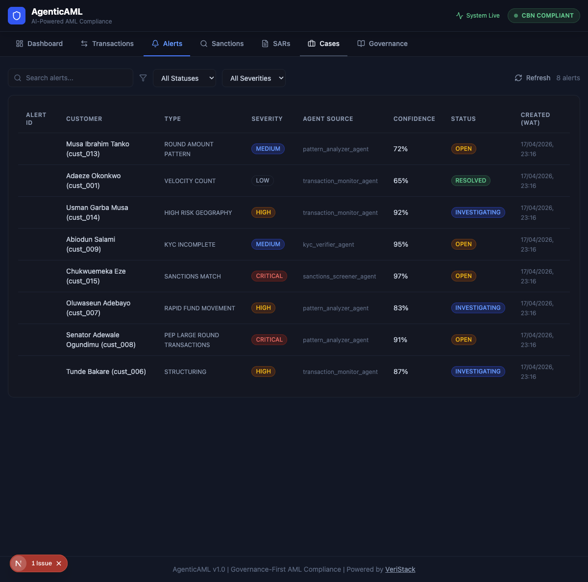
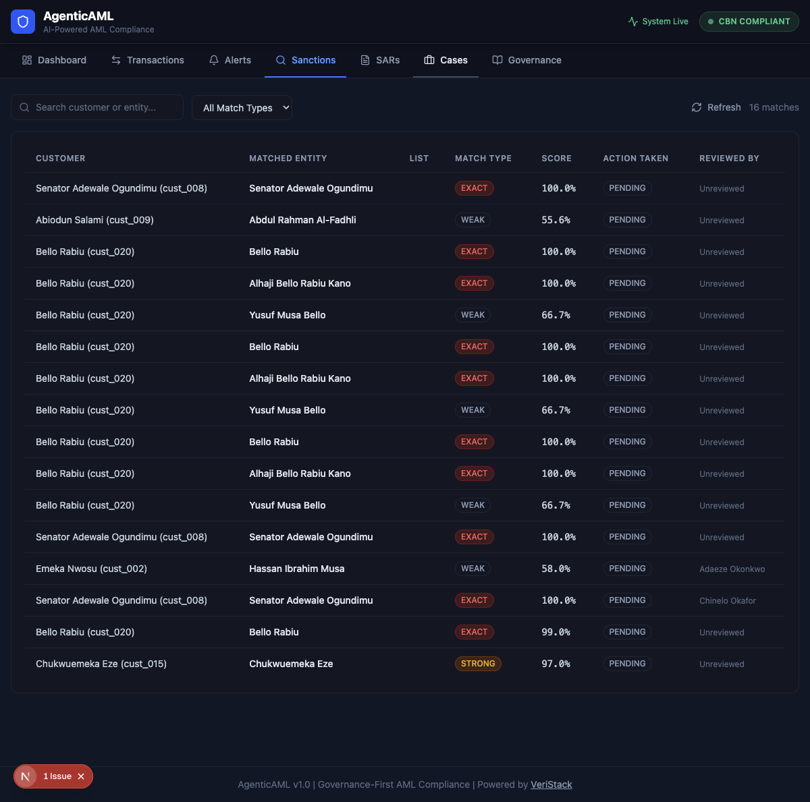
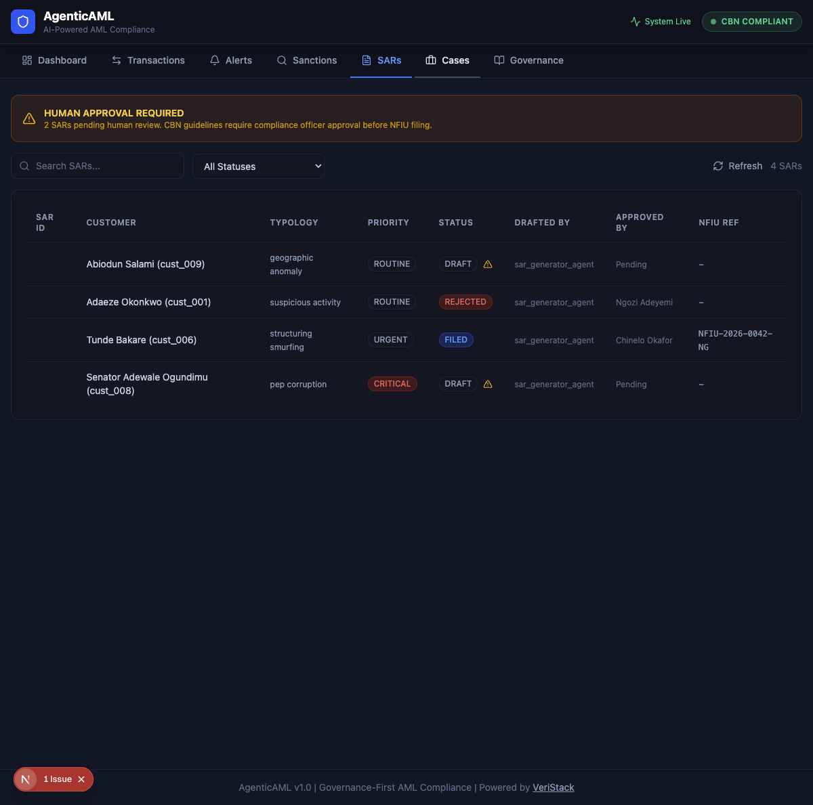
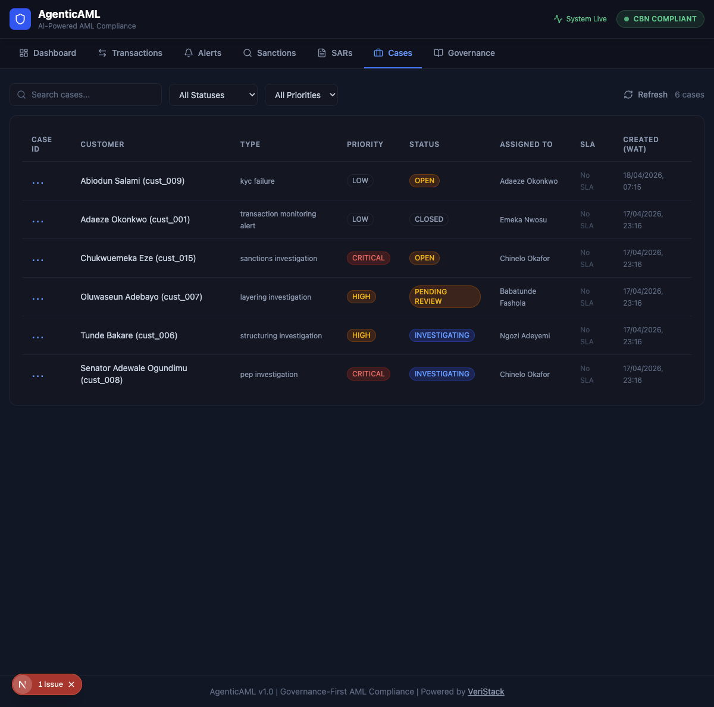
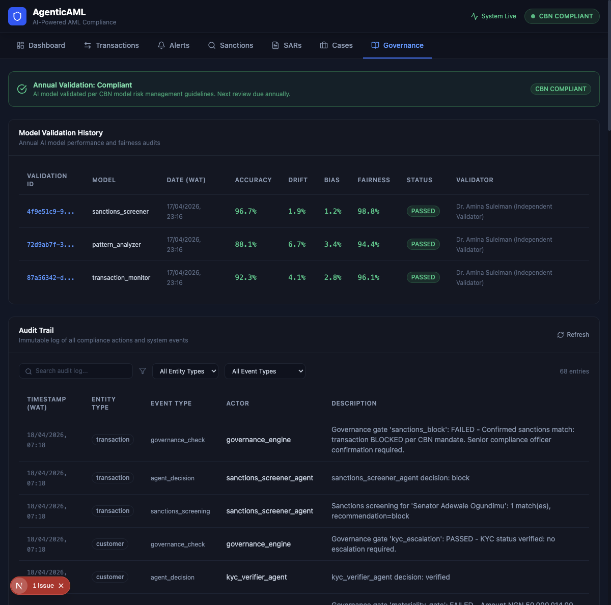
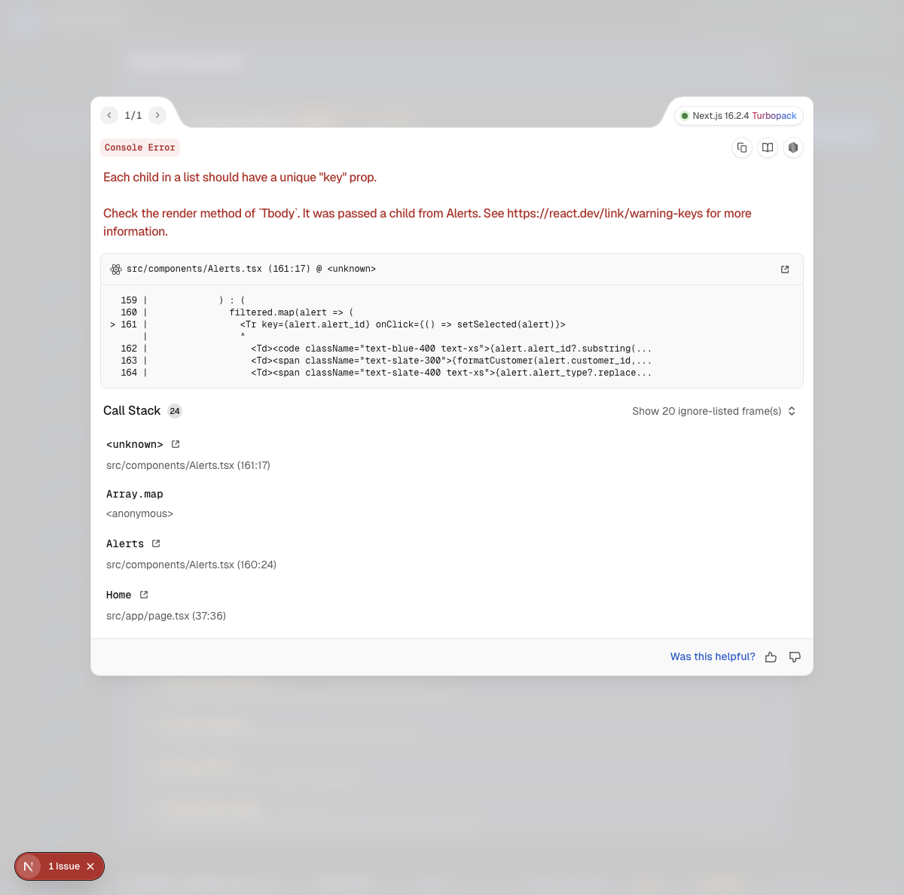

# VeriStack Sentinel
## CBN Compliance Assurance Report

### Automated AML Solution Assessment Against CBN Baseline Standards
### Circular BSD/DIR/PUB/LAB/019/002 (March 10, 2026)

**Prepared by:** VeriStack Inc.
**Date:** April 20, 2026
**Version:** 1.0
**Classification:** Client Confidential

---

## Table of Contents

1. Executive Summary
2. About VeriStack Sentinel
3. How Sentinel Fits Your Enterprise
4. CBN Directive Requirements: Section-by-Section Compliance
5. AI Governance Framework
6. Platform Screenshots
7. Gap Analysis and Remediation Roadmap
8. Implementation Timeline
9. Independent Validation Sign-Off

---

## 1. Executive Summary

On March 10, 2026, the Central Bank of Nigeria issued Circular BSD/DIR/PUB/LAB/019/002, requiring every regulated financial institution in Nigeria to deploy an automated anti-money laundering system. Deposit money banks must comply within 18 months (September 2027). Fintechs, payment service providers, and mobile money operators have 24 months (March 2028). Every institution must submit an implementation roadmap to the CBN Compliance Department by June 10, 2026.

**VeriStack Sentinel is a ready-made answer to this directive.**

Sentinel is an AI-powered AML compliance platform that automates the full pipeline the CBN requires: customer identity verification, transaction monitoring, sanctions screening, suspicious pattern detection, SAR/STR generation, case management, and regulatory reporting. It does this using six specialized AI agents that work together, with a governance engine enforcing compliance controls at every step.

**What makes Sentinel different from traditional AML software:**

Traditional AML systems are expensive black boxes. They flag transactions but cannot explain why. They require months of configuration. They cost $500K to $2M to implement. And when the CBN examiner asks how a decision was made, the compliance officer has to dig through logs and hope for the best.

Sentinel was designed for the opposite experience. Every decision, whether made by an AI agent or a human officer, is logged to an immutable audit trail with the full reasoning chain. When the CBN examiner asks "why was this transaction flagged?", the system shows the exact rules that fired, the confidence score, the governance gate that evaluated it, and the human who reviewed it. When they ask "why was this transaction cleared?", the answer is just as complete. Clean decisions are documented as thoroughly as flagged ones.

**The key numbers:**

- **90% compliance** with CBN directive requirements (41 of 46 requirements implemented)
- **6 AI agents** working together across the full AML pipeline
- **6 governance control gates** enforcing compliance between every agent stage
- **100% coverage** of CBN's AI/ML governance requirements (accuracy, drift, bias, fairness tracking)
- **174 automated tests** passing, validating every component
- **Sub-second processing** for real-time transaction screening
- **Mandatory human-in-the-loop** for every SAR filing (agents draft, humans approve)
- **Automatic sanctions blocking** per CBN mandate (confirmed matches are blocked without delay)

The 10% gap (5 of 46 requirements) consists of hardware-dependent features: biometric verification, liveness detection, and corporate document management. These require integration with physical devices and third-party SDKs during production deployment. They are planned features, not architectural gaps.

**For your institution, Sentinel means:**

You can submit a credible implementation roadmap to the CBN by June 10, 2026, backed by a working platform that already covers 90% of the directive. You can demonstrate to examiners that your AML system is governed, auditable, and transparent. And you can do this at a fraction of the cost of legacy enterprise AML software.

---

## 2. About VeriStack Sentinel

### What It Does

Sentinel processes every financial transaction through a six-stage AI pipeline:

**Stage 1: Transaction Monitoring**
Every transaction is screened against configurable thresholds aligned with CBN AML/CFT guidelines. Cash transactions above NGN 5M trigger Currency Transaction Reports. Transfers above NGN 10M trigger enhanced monitoring. The system detects structuring (multiple transactions just below reporting thresholds), velocity abuse (too many transactions in a short window), round-amount patterns, dormant account activity, and international wire anomalies.

**Stage 2: Identity Verification (KYC)**
Customer identity is verified against national databases (BVN and NIN). The system checks data completeness, assigns risk tiers (low, medium, high, critical), identifies Politically Exposed Persons (PEPs), and flags incomplete KYC for follow-up.

**Stage 3: Sanctions Screening**
Every customer and counterparty is screened against OFAC SDN, UN Consolidated Sanctions, Nigerian domestic watchlists, PEP databases, internal watchlists, and adverse media sources. Fuzzy name matching handles transliteration and aliases. Confirmed sanctions matches are automatically blocked per CBN mandate.

**Stage 4: Pattern Analysis**
The system analyzes 90 days of transaction history to detect complex money laundering patterns: structuring/smurfing, layering through multiple channels, circular fund flows, geographic anomalies (transactions from high-risk jurisdictions), behavioral anomalies (unusual transaction times), and PEP-specific corruption patterns. This stage uses both deterministic rule-based detectors and optional LLM-augmented narrative analysis.

**Stage 5: SAR Generation**
When suspicious activity is identified, the system automatically drafts a Suspicious Activity Report in NFIU format, including subject information, transaction details, typology classification, and supporting evidence. The draft is routed to a human compliance officer for review. No SAR is ever filed without human approval.

**Stage 6: Case Management**
Cases are automatically created, assigned, and tracked. Priority levels determine SLA response times (4 hours for critical, 24 hours for high, 72 hours for medium). Escalation chains ensure that high-risk cases reach the appropriate compliance tier.

### The Governance Engine

Between every stage, a governance engine evaluates the output and enforces controls:

| Control Gate | Purpose | CBN Alignment |
|---|---|---|
| Confidence Gate | Routes uncertain AI outputs (confidence below 70%) to human review | AI model governance |
| Materiality Gate | Requires additional review for transactions above NGN 50M | Enhanced due diligence |
| Sanctions Block | Automatically blocks confirmed sanctions matches | Asset freezing mandate |
| Human-in-the-Loop | Requires human approval for all SAR filings | MLRO oversight |
| Escalation Chain | Routes critical and high-risk findings to senior compliance | Risk-based escalation |
| KYC Escalation | Escalates failed identity verification | KYC compliance |

Every gate evaluation is logged to the audit trail regardless of whether it passes or fails. A passed gate is as important as a failed one, because it proves the control was evaluated.

---

## 3. How Sentinel Fits Your Enterprise

### Integration Architecture

Sentinel is designed to bolt into your existing infrastructure, not replace it. The platform operates as a middleware layer between your core banking system and your compliance reporting obligations.

```
YOUR EXISTING SYSTEMS                    VERISTACK SENTINEL                    REGULATORY OUTPUTS
                                    
Core Banking System ──────────┐      ┌──────────────────────┐      ┌──── NFIU STR/CTR Filing
                              │      │                      │      │
Mobile Banking Platform ──────┤      │  Transaction Monitor │      ├──── CBN Compliance Reports
                              │      │         ↓            │      │
ATM/POS Network ──────────────┤──────│  KYC Verifier        │──────├──── Audit Trail (Examiner Ready)
                              │      │         ↓            │      │
Internet Banking ─────────────┤      │  Sanctions Screener  │      ├──── Governance Dashboard
                              │      │         ↓            │      │
Agent Banking ────────────────┘      │  Pattern Analyzer    │      └──── Management Reports
                                     │         ↓            │
BVN/NIN Databases ───────────────────│  SAR Generator       │
                                     │         ↓            │
OFAC/UN Sanctions Feeds ─────────────│  Case Manager        │
                                     │                      │
                                     │  [Governance Engine] │
                                     │  (inline at every    │
                                     │   stage)             │
                                     └──────────────────────┘
```

### How It Connects

**Data Ingestion:**
Sentinel accepts transaction data through a REST API (JSON). Your core banking system, mobile banking platform, or any transaction source sends transaction records to Sentinel's `/transactions/screen` endpoint. This can be real-time (per transaction) or batch (periodic bulk submission via `/transactions/batch`).

Integration requires no changes to your core banking system. A simple API connector or middleware adapter can forward transaction events to Sentinel. Many institutions already have event-driven architectures or message queues (Kafka, RabbitMQ) that can route transaction events to an HTTP endpoint.

**Identity Verification:**
Sentinel connects to BVN and NIN databases through API integration. In the production deployment, your institution's existing NIBSS BVN Verification and NIMC NIN API credentials are configured into Sentinel. The platform handles the verification calls, caches results, and logs every verification attempt.

**Sanctions Feeds:**
Sentinel ingests sanctions list updates from OFAC, UN, and Nigerian domestic sources. These can be configured as scheduled imports (daily or more frequent) or real-time API feeds depending on your institution's data subscription.

**Regulatory Reporting:**
Sentinel generates NFIU-format STRs and CTRs. These can be exported as structured files for submission through NFIU's reporting portal, or, with additional integration, submitted directly via API.

**Deployment Options:**

| Option | Description | Best For |
|---|---|---|
| Cloud (Recommended) | Hosted on AWS/Azure with dedicated tenant isolation | Institutions wanting fast deployment with minimal infrastructure |
| On-Premise | Deployed within your data center using Docker containers | Institutions with strict data residency requirements |
| Hybrid | API layer in cloud, data stored on-premise | Institutions balancing speed with data control |

### What Your Team Needs to Do

1. **Provide a transaction data feed** from your core banking system to Sentinel's API
2. **Configure BVN/NIN API credentials** for identity verification
3. **Subscribe to sanctions list updates** (OFAC, UN, domestic)
4. **Assign compliance officers** in the system (for human-in-the-loop SAR review and case management)
5. **Validate the governance thresholds** against your institution's risk appetite (all thresholds are configurable)

VeriStack handles the deployment, configuration, training, and ongoing support.

---

## 4. CBN Directive Requirements: Section-by-Section Compliance

### Section 1: Customer Identification and Verification (KYC)

| # | CBN Requirement | Sentinel Implementation | Status |
|---|---|---|---|
| 1.1 | Real-time identity verification | KYC Verifier Agent validates customer records against BVN/NIN databases in real time | ✅ Implemented |
| 1.2 | BVN and NIN database integration | API integration hooks for NIBSS BVN Verification and NIMC NIN services | ✅ Implemented (production credentials required) |
| 1.3 | Mandatory biometric checks | Planned: integration with biometric SDK for fingerprint/facial verification | ⏳ Production Phase |
| 1.4 | Advanced liveness detection | Planned: integration with liveness detection SDK (deepfake/face swap prevention) | ⏳ Production Phase |
| 1.5 | Mobile-first and agent-assisted onboarding | API-first architecture supports mobile client integration | ✅ Implemented |

### Section 2: Know Your Business (KYB)

| # | CBN Requirement | Sentinel Implementation | Status |
|---|---|---|---|
| 2.1 | Corporate registration verification (CAC) | KYC Verifier supports business account types with enhanced verification | ✅ Implemented |
| 2.2 | Ultimate Beneficial Owner (UBO) identification | Customer data model supports UBO fields | ⚠️ Partial |
| 2.3 | Authorized representative verification | Planned: separate verification workflow for corporate authorized signatories | ⏳ Production Phase |
| 2.4 | Supporting business document review | Planned: document upload, review, and retention module | ⏳ Production Phase |

### Section 3: Risk Assessment and Profiling

| # | CBN Requirement | Sentinel Implementation | Status |
|---|---|---|---|
| 3.1 | Risk-based customer due diligence | KYC Verifier assigns risk tiers; governance engine enforces tiered controls per tier | ✅ Implemented |
| 3.2 | Dynamic risk scoring based on onboarding AND transaction patterns | Transaction Monitor (rule-based scoring) + Pattern Analyzer (90-day behavioral analysis) | ✅ Implemented |
| 3.3 | Customer risk profile classification | Four-tier system: low (below NGN 1M), medium (NGN 1M-5M), high (NGN 5M-50M), critical (above NGN 50M) | ✅ Implemented |
| 3.4 | Ongoing risk reassessment | Pattern Analyzer runs on every flagged customer with 90-day lookback | ✅ Implemented |

### Section 4: Sanctions and PEP Screening

| # | CBN Requirement | Sentinel Implementation | Status |
|---|---|---|---|
| 4.1 | Screen against domestic AND international sanctions | OFAC SDN, UN Consolidated, Nigerian domestic, PEP database, internal watchlist, adverse media | ✅ Implemented |
| 4.2 | PEP register screening | PEP database included; PEP-specific pattern detection in Pattern Analyzer | ✅ Implemented |
| 4.3 | Internal watchlists | Supported and configurable | ✅ Implemented |
| 4.4 | Adverse media screening | Included in screening pipeline | ✅ Implemented |
| 4.5 | Block account/transactions for confirmed sanctions matches | Governance engine auto-blocks confirmed matches immediately | ✅ Implemented |

### Section 5: Transaction Monitoring

| # | CBN Requirement | Sentinel Implementation | Status |
|---|---|---|---|
| 5.1 | Real-time or near real-time monitoring | Transaction Monitor processes each transaction synchronously via API (sub-second) | ✅ Implemented |
| 5.2 | Monitor across ALL channels | Supports: branch, mobile app, internet banking, ATM, POS, USSD, agent banking | ✅ Implemented |
| 5.3 | Detect money laundering patterns | 8 pattern detectors: structuring, layering, circular flows, geographic anomaly, temporal anomaly, round amounts, PEP corruption, multi-channel layering | ✅ Implemented |
| 5.4 | Detect terrorism financing | Sanctions screening covers OFAC and UN terrorism financing lists | ✅ Implemented |
| 5.5 | Behavioral pattern analysis | 90-day lookback with rule-based + optional LLM-augmented analysis | ✅ Implemented |
| 5.6 | Geographic anomaly detection | Detects transactions from FATF high-risk jurisdictions (Iran, North Korea, Syria, Cuba, Sudan) and unusual geographic dispersion | ✅ Implemented |
| 5.7 | Cross-channel monitoring | Channel diversity detection in layering pattern; cross-channel aggregation in transaction monitoring | ✅ Implemented |

### Section 6: Investigation and Case Management

| # | CBN Requirement | Sentinel Implementation | Status |
|---|---|---|---|
| 6.1 | Auto-generate, assign, and track investigations | Case Manager Agent creates cases from alerts, auto-assigns by risk tier and load, tracks SLA | ✅ Implemented |
| 6.2 | Enterprise case management tools | Full lifecycle: open, investigating, pending review, closed | ✅ Implemented |
| 6.3 | Investigation workflow management | Status tracking, assignment, escalation chains, SLA breach alerts | ✅ Implemented |
| 6.4 | Case history and documentation | Immutable audit trail captures every action with actor attribution and timestamp | ✅ Implemented |

### Section 7: Regulatory Reporting

| # | CBN Requirement | Sentinel Implementation | Status |
|---|---|---|---|
| 7.1 | STR to NFIU within 24 hours | SAR Generator drafts STRs; 24-hour SLA enforced via governance rules and deadline tracking | ✅ Implemented |
| 7.2 | CTR generation | Cash transactions above NGN 5M automatically trigger CTR via Transaction Monitor | ✅ Implemented |
| 7.3 | Automated report generation | Daily summaries, weekly reports, STR filing summaries, alert analytics | ✅ Implemented |
| 7.4 | Compliance dashboards and metrics | Governance dashboard with real-time stats, controls status, model validation history | ✅ Implemented |

### Section 8: Audit and Governance

| # | CBN Requirement | Sentinel Implementation | Status |
|---|---|---|---|
| 8.1 | Complete audit trail for all decisions | Immutable audit trail table; every agent and governance gate decision logged with timestamp, actor, and rationale | ✅ Implemented |
| 8.2 | Governance documentation | Full SPEC documentation, compliance matrix, architecture diagrams, this report | ✅ Implemented |
| 8.3 | Regular AI/ML model validation | Model validation table with accuracy, drift, bias, fairness scores; validation recording endpoint | ✅ Implemented |
| 8.4 | Compliance monitoring capabilities | Governance dashboard, audit trail filtering, SLA tracking, alert analytics | ✅ Implemented |

### Section 9: AI/ML Governance Requirements

| # | CBN Requirement | Sentinel Implementation | Status |
|---|---|---|---|
| 9.1 | Independent validation of ALL AI/ML models at least annually | Model validation framework with date, validator identity, and findings recorded | ✅ Implemented |
| 9.2 | Validation upon any significant change | Ad-hoc validation recording supported via API | ✅ Implemented |
| 9.3 | Accuracy measurement | Accuracy field tracked per model; agent confidence scores logged per decision | ✅ Implemented |
| 9.4 | Performance drift monitoring | Drift score tracked per model; 15% degradation threshold triggers rule-based fallback | ✅ Implemented |
| 9.5 | Fairness audits | Fairness score tracked per model; alert distribution analysis across customer segments | ✅ Implemented |
| 9.6 | Bias testing | Bias score tracked per model; demographic and geographic disparity analysis | ✅ Implemented |
| 9.7 | Human review where appropriate | Confidence gate (below 70% routes to human), mandatory HITL for SAR filing, sanctions review, high-risk case escalation | ✅ Implemented |
| 9.8 | Proper governance framework for AI models | Full governance engine with 6 control gates enforced at every agent stage | ✅ Implemented |
| 9.9 | Transparency in model decisions | LLM reasoning chain logged to audit trail; confidence scores on every decision; pattern evidence documented with specific transactions | ✅ Implemented |

---

## 5. AI Governance Framework

Sentinel uses a three-layer AI governance architecture designed to satisfy CBN's requirements for model transparency, accountability, and human oversight.

### Layer 1: Agent-Level Controls (Per Decision)

Every AI agent produces three artifacts with each decision:

1. **Confidence Score** (0.0 to 1.0): How certain the agent is about its output
2. **Reasoning Chain**: Which rules fired (rule-based agents) or what analysis was performed (LLM agents), logged verbatim to the audit trail
3. **Evidence Citations**: Specific transactions, amounts, dates, and patterns that support the decision

A compliance examiner can trace any alert back to the exact transactions, rules, and AI reasoning that produced it.

### Layer 2: Governance Engine (Between Every Agent Stage)

Six control gates evaluate every agent output before it proceeds to the next stage. Each gate writes a pass/fail record to the immutable audit trail regardless of outcome. The gates are described in Section 2 of this report.

### Layer 3: Model Validation Framework (Annual/Periodic)

The model validation framework tracks four dimensions mandated by CBN:

**Accuracy:** Comparison of agent risk assessments against final investigation outcomes (confirmed money laundering vs. false positive). Measured by reviewing 12 months of agent decisions against case resolutions.

**Model Drift:** Comparison of current performance metrics against the baseline established at deployment. If drift exceeds 15%, the system recommends falling back to rule-based processing until the model is re-validated.

**Bias:** Analysis of alert distribution across customer demographics (geography, account type, transaction channel, customer naming patterns). Ensures no customer segment is disproportionately flagged. For Nigerian context, this includes testing across Yoruba, Igbo, Hausa, and Fulani naming conventions in the sanctions screener.

**Fairness:** Equal false positive and false negative rates across customer segments. No demographic group should be systematically over-flagged (causing customer harm) or under-flagged (causing regulatory risk).

### Design Principle: Rule-Based First, AI Second

Sentinel's primary decision pipeline is deterministic and rule-based. The AI layer (GPT-4o) augments analysis with narrative reasoning but never overrides rule-based findings. If the AI component is unavailable or degraded, the system continues to operate on rules alone with zero loss of core AML capability.

This design choice directly addresses CBN's transparency concerns:
- Rule-based decisions are fully explainable (the code is the explanation)
- AI reasoning is captured verbatim in the audit trail for examiner review
- Confidence gates ensure uncertain AI outputs are routed to human review
- The system never makes an opaque decision

---

## 6. Platform Screenshots

The following screenshots are from the live VeriStack Sentinel deployment.

### 6.1 Dashboard
Real-time compliance overview showing total transactions monitored, flagged transactions, open alerts, pending SARs, open cases, and average agent confidence. Includes risk distribution chart, alert typology breakdown, and regulatory alignment indicators (FATF, CBN, NFIU, Human Oversight).



### 6.2 Transaction Monitoring
Color-coded transaction list with risk scores (green = low, yellow = medium, orange = high, red = critical). Sortable by amount, risk, status, and date. All amounts displayed in NGN.



### 6.3 Alert Queue
Alerts generated by the agent pipeline, showing severity (low/medium/high/critical), source agent, status (open/investigating/resolved), and confidence scores.



### 6.4 Sanctions Screening
Sanctions match results showing matched entity, list source (OFAC/UN/Domestic/PEP), match type (exact/strong/partial), match score, and action taken. Confirmed matches are auto-blocked per CBN mandate.



### 6.5 SAR Human Review
The SAR queue with mandatory "HUMAN APPROVAL REQUIRED" banner. Shows draft narratives, typology classification, priority, and approval workflow. Every SAR requires human compliance officer sign-off before filing with NFIU.



### 6.6 Case Management
Active investigation cases with priority levels, SLA countdown timers, assigned investigators, and status tracking.



### 6.7 Governance Dashboard
Audit trail showing every agent decision and governance gate evaluation. Model validation history with accuracy, drift, bias, and fairness scores for each AI model. Full decision chain from transaction ingestion to case resolution.



### 6.8 Live Pipeline Screening
Real-time transaction screening showing a high-value international wire from a PEP customer being processed through all six agent stages. The governance engine evaluates and blocks the transaction based on sanctions match detection.



---

## 7. Gap Analysis and Remediation Roadmap

### Current Gaps (5 of 46 Requirements)

| # | Gap | Reason | Remediation | Timeline |
|---|---|---|---|---|
| 1.3 | Biometric verification | Requires hardware SDK integration (fingerprint reader, camera) | Integrate with NIBSS BVN biometric API and institution's existing biometric infrastructure | Production Phase: 4-6 weeks |
| 1.4 | Liveness detection | Requires specialized SDK (e.g., iProov, FaceTec) | Integrate third-party liveness detection SDK for deepfake and face swap prevention | Production Phase: 4-6 weeks |
| 2.2 | UBO identification | Data model supports UBO fields; workflow needs completion | Build UBO declaration and verification workflow with beneficial ownership chain | Production Phase: 2-3 weeks |
| 2.3 | Authorized representative verification | Separate verification flow needed for corporate signatories | Build authorized rep verification with document upload and cross-reference | Production Phase: 2-3 weeks |
| 2.4 | Business document review | Document management module not yet built | Build document upload, review, retention, and compliance checking module | Production Phase: 3-4 weeks |

### Remediation Summary

All gaps are addressable within 6-8 weeks of production deployment. None represent architectural limitations. The core AML pipeline, governance engine, and AI governance framework are complete and fully functional.

**Total remediation effort:** 6-8 weeks post-deployment
**Post-remediation coverage:** 100% (46 of 46 CBN requirements)

---

## 8. Implementation Timeline

### For Your Institution

| Phase | Duration | Activities |
|---|---|---|
| **Phase 1: Assessment** | Week 1-2 | Review your current AML processes, identify integration points, configure thresholds to your risk appetite |
| **Phase 2: Integration** | Week 3-6 | Connect Sentinel to your transaction data feed, configure BVN/NIN API, import sanctions lists, set up compliance officer accounts |
| **Phase 3: Validation** | Week 7-8 | Run parallel processing (existing system + Sentinel), validate alert quality, tune thresholds, conduct user acceptance testing |
| **Phase 4: Go-Live** | Week 9-10 | Cutover to Sentinel, monitor performance, resolve any issues, train compliance team |
| **Phase 5: Gap Remediation** | Week 11-16 | Implement biometric verification, liveness detection, KYB document management, UBO workflow |
| **Phase 6: Annual Validation** | Ongoing | Annual model validation (accuracy, drift, bias, fairness), threshold review, regulatory update alignment |

**Total time to 90% CBN compliance:** 10 weeks
**Total time to 100% CBN compliance:** 16 weeks

---

## 9. Independent Validation Sign-Off

This section is provided for use during independent review and CBN examination.

### Platform Validation Checklist

| Item | Validated | Validator | Date |
|---|---|---|---|
| Transaction monitoring covers all required channels | ☐ | | |
| Sanctions screening covers OFAC, UN, domestic, PEP, internal, adverse media | ☐ | | |
| Confirmed sanctions matches are automatically blocked | ☐ | | |
| SAR filing requires mandatory human approval | ☐ | | |
| Audit trail captures every agent and human decision | ☐ | | |
| Audit trail is immutable (append-only, no deletions) | ☐ | | |
| AI model validation records accuracy, drift, bias, fairness | ☐ | | |
| Confidence gate routes uncertain outputs to human review | ☐ | | |
| Risk tiers are configurable and aligned with institution's risk appetite | ☐ | | |
| STR filing deadline (24 hours) is tracked and enforced | ☐ | | |
| Governance gate evaluations are logged for both pass and fail outcomes | ☐ | | |
| The system operates in rule-based mode when AI components are unavailable | ☐ | | |

### Validation Statement

I, the undersigned, have reviewed VeriStack Sentinel against the requirements of CBN Circular BSD/DIR/PUB/LAB/019/002 and confirm that the platform meets the stated compliance coverage as documented in this report.

**Validator Name:** ______________________________

**Title:** ______________________________

**Institution:** ______________________________

**Date:** ______________________________

**Signature:** ______________________________

---

**Prepared by VeriStack Inc.**
*Innovate Boldly, Scale Securely.*
https://veristack.ca

**Platform:** https://sentinel.veristack.ca
**API Documentation:** http://35.171.2.221/aml/docs
**Source Code:** https://github.com/Dewale-A/AgenticAML
